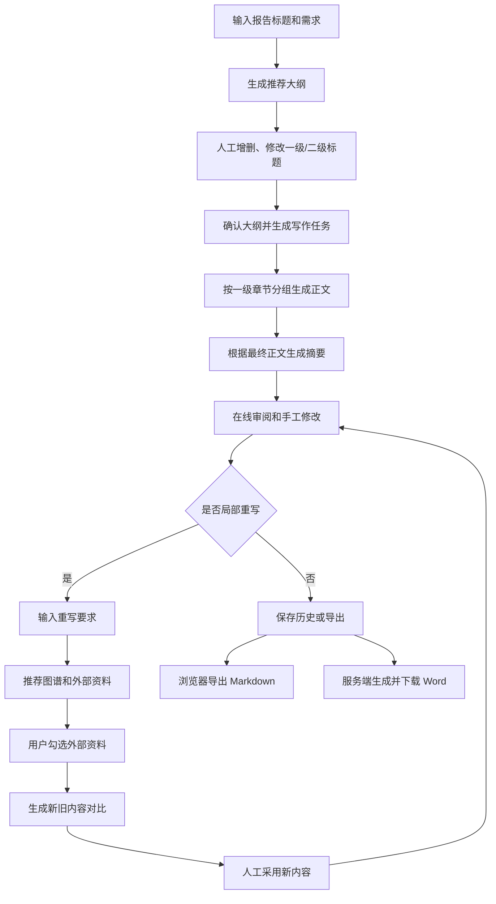
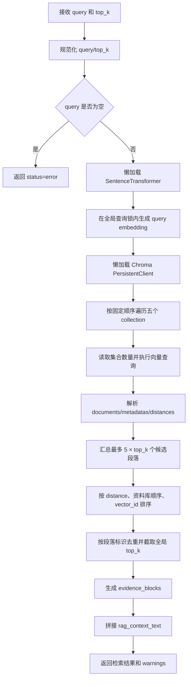
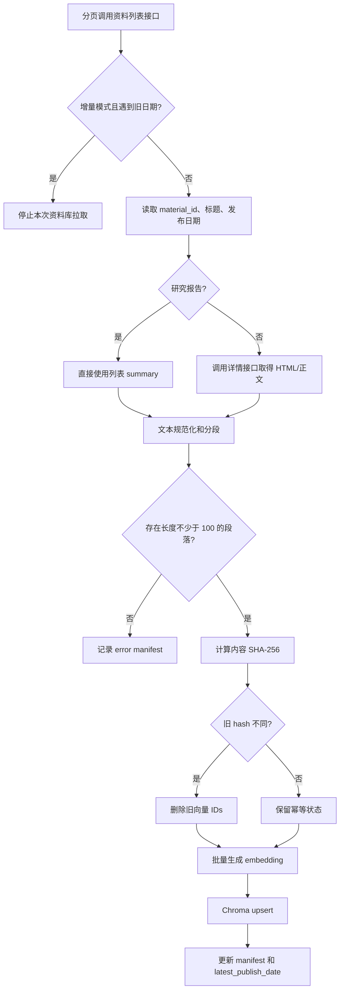

# 产业报告项目交接文档

## 1. 概览

### 1.1 当前已经实现的能力

产业报告是主系统中的一个独立前端工作区，采用分阶段、多智能体方式生成报告，而不是一次调用生成整篇文章。当前支持：

1. 根据用户需求和固定 Word 模板生成报告标题、一级大纲和二级大纲。
2. 允许用户在前端增删、修改一级和二级标题。
3. 对每个二级标题分别检索 AI 产业知识图谱和五类外部资料库。
4. 由统筹智能体把检索材料整理成每个二级标题的正文写作任务书。
5. 以一级标题为并发单位、以同一一级标题下的二级标题为顺序单位生成正文。
6. 根据最终大纲和正文生成摘要。
7. 在线编辑摘要和正文，并对单个二级标题执行“推荐资料—选择资料—重写—人工确认”。
8. 在浏览器端导出 Markdown，或在服务器端生成并下载 Word。

### 1.2 当前范围边界

- **产业范围仅支持人工智能**。虽然主系统存在多个产业数据目录，前端产业名称映射也包含具身智能、低空经济和海洋经济，但报告后端各 Agent 的 `SUPPORTED_INDUSTRIES` 只有 `ai`，图谱检索器也固定读取 AI 图谱。
- 报告结构由根目录的 `产业链报告模板.docx` 决定。当前模板包含摘要和四个正文一级章节：
  - 产业链发展总体态势
  - 央企在产业链布局现状分析
  - 央企在产业链发展面临的突出问题
  - 央企在产业链发展的对策建议
- 当前报告正文只输出段落，不生成图表、目录、封面或参考文献列表。
- 外部资料库的向量数据是本地运行数据，位于 `report_generation/vector_db/`。

### 1.3 主要入口

| 用途           | 入口                                            |
| -------------- | ----------------------------------------------- |
| 后端服务       | `backend_server.py`                             |
| 前端页面       | `templates/components/industry_report.html`     |
| 前端状态与交互 | `static/js/modules/industry_report.js`          |
| 报告生成代码   | `report_generation/`                            |
| 报告结构模板   | `产业链报告模板.docx`                           |
| AI 图谱        | `static/data/ai/graph_data.json`                |
| 外部资料向量库 | `report_generation/vector_db/`                  |
| LLM 统一客户端 | `llm_client.py`                                 |
| 报告历史       | `report_generation/history/report_history.json` |
| Word 输出      | `report_generation/outputs/`                    |

## 2. 整体实现链路

### 2.1 用户操作流程



## 3. 代码架构与各 Agent 职责

### 3.1 模块总览

| 模块                        | 主入口                                                    | 核心职责                                         |
| --------------------------- | --------------------------------------------------------- | ------------------------------------------------ |
| `outline_agent.py`          | `generate_report_outline()`                               | 解析报告模板、生成标题、为各一级章节生成二级大纲 |
| `graph_retriever.py`        | `retrieve_ai_graph()`                                     | 让 LLM 选择 1-3 个真实 L3 环节，并沿图谱上下扩展 |
| `external_rag/retriever.py` | `retrieve_external_rag()`                                 | 检索五类 Chroma 集合，合并排序后返回全局 Top K   |
| `external_rag/ingestion.py` | `initial_ingest_*()`、`update_*()`                        | 从外部内容接口全量或增量摄入资料                 |
| `coordinator_agent.py`      | `generate_writing_tasks()`                                | 为每个二级标题重新检索，并生成可执行写作任务书   |
| `body_agent.py`             | `generate_report_bodies()`                                | 分组并发生成正文，保留输入顺序和证据块           |
| `summary_agent.py`          | `generate_report_summary()`                               | 根据模板摘要要求、最终大纲和正文生成摘要         |
| `rewrite_agent.py`          | `recommend_rewrite_materials()`、`rewrite_body_section()` | 两阶段局部重写                                   |
| `word_export_agent.py`      | `export_report_docx()`                                    | 清洗正文、分级排版并输出 DOCX                    |

### 3.2 大纲生成：`outline_agent.py`

#### 输入

- `user_prompt`：用户报告需求，必填。
- `industry`：默认 `ai`，当前只接受 `ai`。
- `template_path`：可选；不传时使用根目录 `产业链报告模板.docx`。

#### 实际步骤

1. 校验用户需求和产业。
2. 直接读取 DOCX 压缩包中的 `word/document.xml`，提取非空段落。
3. 通过固定文本规则识别模板中的标题、摘要和正文章节：
   - 段落以“标题”开头，视为标题说明；
   - 段落以“摘要”开头，视为摘要说明；
   - 正文一级标题必须命中代码中的四个固定 marker；
   - 在标题后的段落中查找以“要求：”或“要求:”开头的要求。
4. 调用 LLM 生成不超过 20 个汉字的报告标题。
5. 对每个正文一级章节依次构造检索 query。
6. 分别调用知识图谱检索和外部资料库检索。
7. 调用 LLM 生成 2-4 个二级标题，每项包含 `title`、`writing_focus`、`suggested_query`。
8. 为二级标题补充 `outline_id`，例如 `S2.1`。

#### 输出

- `report_title`
- `outline`
- `flat_subsections`
- `warnings`

后端输出中如果模板存在摘要要求，会把摘要作为 `section_type=abstract` 的一级项加入 `outline`；前端规范化时会过滤该项，摘要改由 `summary_agent` 在正文生成后单独生成。

### 3.3 知识图谱检索：`graph_retriever.py`

#### 当前数据范围

- 固定产业：`ai`
- 固定路径：`static/data/ai/graph_data.json`
- 层级关系：`从属于`
- 实体到环节关系：`参与环节`

#### 检索逻辑

1. 启动一次检索时加载整个 AI 图谱。
2. 找出 `labels` 包含“环节”且 `properties.level == 3` 的全部 L3 节点。
3. 把完整 L3 清单以及对应 L1/L2 路径发给 LLM。
4. 要求 LLM 只能选择 1-3 个真实 L3，并返回 `id`、`name`、`reason`、`score`。
5. 代码再次校验：
   - ID 必须真实存在；
   - 名称必须与图谱完全一致；
   - 数量必须为 1-3；
   - 分数被限制在 0-1。
6. 对每个命中的 L3：
   - 沿 L3 → L2 → L1 的出边“从属于”向上查找；
   - 沿指向 L3 的入边“参与环节”查找全部企业/实体；
   - 生成 `chain_path`、`upward_path`、`downward_entities` 和自然语言上下文。

### 3.4 外部 RAG 检索：`external_rag/`

#### 3.4.1 入口和完整调用链

统一入口为：

```python
retrieve_external_rag(query: str, top_k: int = 10) -> dict
```



该检索是纯向量召回，不调用 LLM，不包含关键词召回、BM25、metadata 过滤或重排模型。资料如何进入向量库见第 5 章。

#### 3.4.2 Embedding 模型和设备选择

模型由 `external_rag/vector_store.py::get_embedding_model()` 从本地 `RAG/models/` 延迟加载。根据当前模型目录配置：

| 项目                             | 当前值                |
| -------------------------------- | --------------------- |
| 模型                             | `all-MiniLM-L6-v2`    |
| 输出维度                         | 384                   |
| Pooling                          | Mean Pooling          |
| 输出归一化                       | 启用 `Normalize` 模块 |
| SentenceTransformer 最大序列长度 | 256 tokens            |
| 模型目录                         | `RAG/models/`         |

设备选择规则：

1. 能导入 PyTorch 且 `torch.cuda.is_available()` 为真时使用 CUDA。
2. 没有 CUDA 或 PyTorch 检测失败时使用 CPU。
3. 模型对象由 `_embedding_model_lock` 保护，只在进程内初始化一次。

查询向量的实际调用为：

```python
model.encode(
    [query],
    show_progress_bar=False,
    batch_size=1,
)
```

`_QUERY_EMBEDDING_LOCK` 会把同一进程内的 query embedding 编码串行化，避免多个统筹线程同时进入模型编码。该锁只覆盖 `model.encode()`，不覆盖后续 Chroma 查询。

#### 3.4.3 Chroma client 和当前索引配置

Chroma client 由 `get_chroma_client()` 创建：

```python
chromadb.PersistentClient(
    path="report_generation/vector_db"
)
```

- client 由 `_chroma_client_lock` 保护，并在进程内复用。
- 初始化时会自动创建 `report_generation/vector_db/` 目录；因此目录不存在时不一定立即报错，后续会表现为五个 collection 均不可用。
- 在线检索使用 `client.get_collection(name=...)`，不会静默新建缺失的 collection。
- 摄入流程使用 `get_or_create_collection()`，两者行为不同。

代码创建 collection 时只传入名称，没有显式指定向量维度、距离空间或 HNSW 参数。根据当前 `chroma.sqlite3` 中五个实际 collection 的 schema：

| 项目              | 当前数据库实际值 |
| ----------------- | ---------------- |
| 向量维度          | 384              |
| 距离空间          | L2               |
| 索引              | HNSW             |
| `ef_construction` | 100              |
| `max_neighbors`   | 16               |
| `ef_search`       | 100              |
| 索引线程数        | 16               |
| HNSW batch size   | 100              |
| sync threshold    | 1000             |

以上是**当前数据库实际配置**，不是代码显式保证的固定配置。重建向量库或升级 Chroma 后必须重新核对 dimension、distance space 和 HNSW schema，避免同一套代码因库默认值变化而产生不同检索结果。

当前 embedding 带归一化，L2 距离越小表示向量越接近。接口直接返回 Chroma 的原始 `distance`。

#### 3.4.4 五库逐库召回

检索顺序来自 `EXTERNAL_LIBRARIES` 的定义顺序：

1. `policy`：政策法规
2. `speech`：领导讲话
3. `expert_view`：专家观点
4. `company_case`：企业案例
5. `research_report`：研究报告

每个资料库按以下逻辑处理：

1. 使用配置中的 collection 名称调用 `client.get_collection()`。
2. 调用 `collection.count()` 取得段落向量数量。
3. 集合为空时记录 warning 并跳过。
4. 调用 Chroma：

```python
collection.query(
    query_embeddings=[query_embedding],
    n_results=effective_n_results,
    include=["documents", "metadatas", "distances"],
)
```

Chroma 对单 query 返回嵌套列表。代码只取第一组 `ids`、`documents`、`metadatas` 和 `distances`：

#### 3.4.5 跨库排序、去重和全局 Top K

所有资料库候选合并后，通过 `_select_top_candidates()` 统一排序：

1. 首先按 `distance` 从小到大。
2. distance 缺失、无法转换或为 NaN 时按正无穷处理，排到最后。
3. distance 相同时，按政策法规、领导讲话、专家观点、企业案例、研究报告的固定库顺序。
4. 仍相同时按 `vector_id` 字符串排序，保证结果相对稳定。

去重键优先使用 `vector_id`。只有 `vector_id` 为空时，才退回：

```text
library + material_id + paragraph_index + text
```

#### 3.4.6 `evidence_blocks` 和 Prompt 上下文

最终每个候选被转换为证据块：

- `citation_id`：按最终排名生成 `外部资料1`、`外部资料2`……
- `rank`
- `library`
- `classification_type` / `classification_name`
- `material_id`
- `title`
- `publish_date`
- `source_address`
- `paragraph_index`
- `vector_id`
- `distance`
- `text`

字段优先取 Chroma metadata；`library`、分类编码和分类名称缺失时使用当前资料库配置回填，其他缺失文本使用空字符串。`paragraph_index` 会尝试转为整数。

`_build_rag_context_text()` 再把证据块拼成供后续 Agent 使用的纯文本：

```text
【外部资料库检索结果】

[外部资料1]
资料类型：政策法规
标题：资料标题
发布日期：YYYY-MM-DD
来源：来源地址
段落序号：0
内容：完整段落文本
```

LLM 看到的是按最终排名排列的资料类型、标题、日期、来源、段落序号和正文；`distance` 不会写入 `rag_context_text`，只保留在结构化 `evidence_blocks` 中。

#### 3.4.7 不同报告阶段如何调用 RAG

| 阶段         | query 组成                                                     |           `top_k` | 检索结果用途                                                    |
| ------------ | -------------------------------------------------------------- | ----------------: | --------------------------------------------------------------- |
| 大纲生成     | 用户需求、报告标题、产业名称、当前一级大纲、模板要求、检索目标 |           固定 10 | 帮助 LLM 为当前一级大纲生成二级标题                             |
| 统筹任务     | 用户需求、报告标题、当前一级标题、当前二级标题、检索目标       | 前端传入，默认 10 | 生成该二级标题的写作任务书，并随 `writing_task` 保存            |
| 正文生成     | 不重新检索                                                     |                无 | 直接使用 `writing_task.external_rag_retrieval.rag_context_text` |
| 局部重写推荐 | 用户重写要求、报告标题、当前一级标题、当前二级标题、检索目标   | 前端传入，默认 10 | 返回候选资料供用户勾选                                          |
| 局部重写生成 | 不重新检索                                                     |                无 | 只使用推荐阶段的图谱结果和用户勾选的外部证据                    |
| 摘要与导出   | 不调用 RAG                                                     |                无 | 使用已经生成的正文                                              |

大纲阶段不读取前端的检索数量，始终使用 10。统筹阶段会为每个最终二级标题重新检索，不复用大纲阶段资料；正文阶段也不会验证资料是否在两次生成之间发生更新。

### 3.5 统筹写作任务：`coordinator_agent.py`

#### 输入

- 用户原始需求
- 报告标题
- 用户最终确认的 `outline`
- `top_k`

#### 实际步骤

1. 只展平 `section_type=body` 且标题非空的二级标题。
2. 为每个二级标题重新构造检索 query，不复用大纲阶段的检索结果。
3. 对每个二级标题重新执行图谱检索和外部 RAG。
4. 调用 LLM，把检索内容整理为 `writing_system_prompt`。
5. 任务书被要求包含：
   - 当前写作范围
   - 写作任务
   - 材料要点
   - 外部资料要点
   - 写作结构
   - 边界要求
6. 代码会强制补入“不标注内部引用编号、不输出参考文献、不生成其他章节”等硬规则。

#### 并发方式

`generate_writing_tasks()` 使用：

```python
ThreadPoolExecutor(max_workers=len(final_subsections))
```

即所有二级标题同时执行，**不受前端“并发数”控制**。二级标题较多时会同时触发大量图谱 LLM、RAG 和统筹 LLM 调用。

### 3.6 正文生成：`body_agent.py`

#### 分组与并发

1. 写作任务按 `parent_level1_id` 分组；没有 ID 时退回一级标题或任务索引。
2. 不同一级标题组可并发，最大并发由接口参数 `max_workers` 控制。
3. 同一一级标题下的二级标题严格按输入顺序串行生成。
4. 每生成一个成功小节，会把该组此前成功正文放入下一小节的 prompt，帮助避免重复。
5. 每段既有正文最多取前 1200 个字符作为前文上下文。
6. 最终 `body_sections` 始终按原 `writing_tasks` 顺序返回。

#### 正文要求

Prompt 要求：

- 只生成当前二级标题正文；
- 不超过 1000 字；
- 不超过 3 个自然段；
- 避免同一一级标题下观点、案例、数据、句式重复；
- 不输出标题、表格、图片、参考文献或其他章节；
- 图谱内部编号不得出现；
- 涉及讲话、数字、政策时，可使用真实外部资料标题作为方括号引用。

这些字数、段落和引用规则目前主要依靠 LLM 遵循，代码没有做完整的确定性验收。

#### 清洗与状态

- 移除包裹整个输出的 Markdown 代码块；
- 移除 `[知识图谱1]`、`[外部资料1]` 一类内部编号；
- 如果检测到尾部“参考文献/引用列表/资料来源”标题，截断其后的内容。

顶层状态：

- 全部成功：`success`
- 部分成功：`partial_success`
- 全部失败：`error`

每个小节都会保留图谱和外部证据块，供前端展示和后续重写使用。

### 3.7 摘要生成：`summary_agent.py`

#### 输入和逻辑

- 报告标题
- 最终大纲
- 最终正文
- 模板中的摘要要求

Agent 会跳过大纲中的 abstract 项，只把正文一级/二级标题和所有非空正文交给 LLM。Prompt 要求摘要为 400-600 字，并且不得补充正文中没有的信息。

### 3.8 局部重写：`rewrite_agent.py`

局部重写分为两个接口步骤。

#### 第一步：推荐材料

`recommend_rewrite_materials()` 根据：

- 用户重写要求
- 报告标题
- 当前一级标题
- 当前二级标题

重新检索图谱和外部资料。

前端行为：

- 图谱资料自动纳入，不提供取消勾选；
- 外部资料默认全选，用户可以取消勾选。

#### 第二步：生成重写正文

`rewrite_body_section()` 使用：

- 原正文
- 用户重写要求
- 重新检索到的图谱上下文
- 用户最终勾选的外部证据块

生成新正文。前端先展示新旧对比，允许继续编辑新正文，只有点击“采用新内容”才覆盖工作区中的原正文。

### 3.9 Word 导出：`word_export_agent.py`

#### 处理逻辑

1. 清洗摘要和正文中的代码块、内部引用编号、尾部来源章节和非法 XML 字符。
2. 跳过无正文的小节。
3. 按 `parent_level1_id` 或一级标题分组。
4. 重新生成一级、二级章节编号。
5. 写入 `report_generation/outputs/<清洗后的标题>_<时间戳>.docx`。
6. 返回相对路径，前端再调用下载接口。

#### 当前格式

- A4 纵向；
- 上/下/左/右页边距：37/35/27/27 mm；
- 标题：方正小标宋简体，22 pt，居中；
- 一级标题：黑体，16 pt；
- 二级标题：楷体，16 pt；
- 正文：仿宋，16 pt，固定 28 pt 行距，首行缩进 2 字符；
- ASCII 字符使用 Times New Roman；
- 页脚居中插入页码域。

导出模块是从空白文档创建 DOCX，并不把 `产业链报告模板.docx` 当作排版模板。部署机缺少指定中文字体时，Word 或 LibreOffice 会发生字体替换。

## 4. 后端 API

### 4.1 通用约定

- 路由集中在 `backend_server.py`。
- 请求和返回均为 JSON，Word 下载接口除外。

### 4.2 接口清单

| 方法   | 路径                                        | 主要请求字段                                                                                                         | 主要返回字段                                              |
| ------ | ------------------------------------------- | -------------------------------------------------------------------------------------------------------------------- | --------------------------------------------------------- |
| POST   | `/api/report/outline`                       | `user_prompt`, `industry`                                                                                            | `report_title`, `outline`, `flat_subsections`, `warnings` |
| POST   | `/api/report/coordinator`                   | `user_prompt`, `report_title`, `industry`, `outline`, `top_k`                                                        | `writing_tasks`, `warnings`                               |
| POST   | `/api/report/body`                          | `user_prompt`, `report_title`, `industry`, `writing_tasks`, `max_workers`                                            | `body_sections`, `warnings`                               |
| POST   | `/api/report/summary`                       | `report_title`, `industry`, `outline`, `body_sections`                                                               | `abstract_text`, `warnings`                               |
| POST   | `/api/report/rewrite/materials`             | `rewrite_prompt`, `report_title`, `industry`, `body_section`, `top_k`                                                | `graph_retrieval`, `external_rag_retrieval`, `warnings`   |
| POST   | `/api/report/rewrite`                       | `rewrite_prompt`, `report_title`, `industry`, `body_section`, `graph_retrieval`, `selected_external_evidence_blocks` | 新 `body_text` 和采用的证据块                             |
| GET    | `/api/report/history`                       | 无                                                                                                                   | 历史摘要列表 `items`                                      |
| GET    | `/api/report/history/<history_id>`          | 路径参数                                                                                                             | 完整历史记录 `report`                                     |
| POST   | `/api/report/history`                       | `report`                                                                                                             | 保存后的 `report`、最新 `items`                           |
| DELETE | `/api/report/history`                       | `id`                                                                                                                 | 最新 `items`                                              |
| POST   | `/api/report/export/word`                   | `report_title`, `abstract_text`, `industry`, `body_sections`                                                         | `docx_path`, `warnings`                                   |
| GET    | `/api/report/export/word/download?path=...` | `path` 查询参数                                                                                                      | DOCX 文件流                                               |

### 4.3 关键请求示例

#### 生成大纲

```json
{
  "user_prompt": "重点分析人工智能产业竞争格局、央企布局、突出问题和建议。",
  "industry": "ai"
}
```

#### 生成写作任务

```json
{
  "user_prompt": "重点分析人工智能产业竞争格局、央企布局、突出问题和建议。",
  "report_title": "人工智能产业链发展报告",
  "industry": "ai",
  "outline": [],
  "top_k": 10
}
```

`outline` 必须包含至少一个 `section_type=body` 且含非空二级标题的章节。

#### 生成正文

```json
{
  "user_prompt": "重点分析人工智能产业竞争格局、央企布局、突出问题和建议。",
  "report_title": "人工智能产业链发展报告",
  "industry": "ai",
  "writing_tasks": [],
  "max_workers": 3
}
```

#### 推荐重写资料

```json
{
  "rewrite_prompt": "减少宏观铺陈，突出央企算力基础设施布局。",
  "report_title": "人工智能产业链发展报告",
  "industry": "ai",
  "body_section": {},
  "top_k": 10
}
```

### 4.4 核心数据结构

#### 大纲

```json
{
  "level1_id": "S2",
  "level1_title": "人工智能产业链发展总体态势",
  "section_type": "body",
  "template_requirement": "模板要求",
  "section_retrieval_query": "大纲阶段检索 query",
  "graph_retrieval": {},
  "external_rag_retrieval": {},
  "subsections": [
    {
      "outline_id": "S2.1",
      "title": "二级标题",
      "writing_focus": "写作重点",
      "suggested_query": "后续检索建议"
    }
  ],
  "warnings": []
}
```

前端 `normalizeIndustryReportOutline()` 当前只保留二级标题及自己的 `generation_instruction`、`expected_words` 字段，不保留后端生成的 `writing_focus` 和 `suggested_query`。统筹 Agent 也不会使用它们，而是根据用户需求、报告标题和最终标题重新构造 query。

#### 写作任务

```json
{
  "outline_id": "S2.1",
  "parent_level1_id": "S2",
  "parent_level1_title": "人工智能产业链发展总体态势",
  "title": "二级标题",
  "section_retrieval_query": "统筹阶段检索 query",
  "graph_retrieval": {
    "status": "success",
    "graph_context_text": "...",
    "matched_level3": [],
    "evidence_blocks": []
  },
  "external_rag_retrieval": {
    "status": "success",
    "top_k": 10,
    "rag_context_text": "...",
    "evidence_blocks": []
  },
  "writing_system_prompt": "正文生成任务书",
  "warnings": []
}
```

#### 正文小节

```json
{
  "status": "success",
  "outline_id": "S2.1",
  "parent_level1_id": "S2",
  "parent_level1_title": "人工智能产业链发展总体态势",
  "title": "二级标题",
  "body_text": "正文段落",
  "graph_evidence_blocks": [],
  "external_evidence_blocks": [],
  "warnings": []
}
```

#### 外部资料证据块

```json
{
  "citation_id": "外部资料1",
  "rank": 1,
  "library": "policy",
  "classification_type": "1",
  "classification_name": "政策法规",
  "material_id": "资料 ID",
  "title": "资料标题",
  "publish_date": "YYYY-MM-DD",
  "source_address": "来源地址",
  "paragraph_index": 0,
  "vector_id": "external:policy:<material_id>:p:0",
  "distance": 0.0,
  "text": "段落文本"
}
```

#### 历史记录

```json
{
  "id": "local_report_<timestamp>",
  "title": "报告标题",
  "prompt": "用户原始需求",
  "abstractText": "摘要",
  "industry": "ai",
  "outline": [],
  "writingTasks": [],
  "bodySections": [],
  "warnings": [],
  "createdAt": "ISO 时间",
  "updatedAt": "ISO 时间"
}
```

历史会保存完整检索上下文、写作任务书和证据块，因此单条记录可能很大。

## 5. 外部资料库的构建和更新

### 5.1 五类资料

| 逻辑名称          | classification_type | 中文名称 | Chroma collection           |
| ----------------- | ------------------: | -------- | --------------------------- |
| `policy`          |                   1 | 政策法规 | `report_policy_ai`          |
| `speech`          |                   2 | 领导讲话 | `report_speech_ai`          |
| `expert_view`     |                   3 | 专家观点 | `report_expert_view_ai`     |
| `company_case`    |                   4 | 企业案例 | `report_company_case_ai`    |
| `research_report` |                   6 | 研究报告 | `report_research_report_ai` |

外部内容接口地址、AI 栏目 ID 和分类映射定义在 `report_generation/external_rag/client.py`。当前接口地址为明文 HTTP 地址，生产环境应迁移到 HTTPS 或受控内网通道。

### 5.2 摄入流程



### 5.3 文本处理规则

- `research_report` 只使用列表记录的 `summary`，不调用详情接口。
- 其他资料优先从详情接口读取 `contentWithTag`、`content` 或 `summary`。
- HTML 会移除 `script/style/noscript`，按段落、列表项、标题、引用等块标签提取。
- 默认只保留长度不少于 100 个字符的段落。
- 重复段落按原顺序去重。
- 每个材料计算全部段落拼接后的 SHA-256。
- 向量 ID 格式：`external:<library>:<material_id>:p:<index>`。
- 嵌入批大小为 128；代码限制常见 BLAS 环境变量的默认线程数为 4。
- SentenceTransformer 和 Chroma client 均为进程内懒加载单例。

### 5.4 全量、增量和调试调用

当前没有独立 CLI、后台管理接口或定时任务，需要调用 Python 函数。不要把访问令牌写进脚本或提交到 Git。

PowerShell 示例：

```powershell
$env:EXTERNAL_RAG_ACCESS_TOKEN = "<登录凭证>"

# 首次全量摄入五个资料库
python -c "import os,json; from report_generation.external_rag import initial_ingest_all_external_libraries; print(json.dumps(initial_ingest_all_external_libraries(os.environ['EXTERNAL_RAG_ACCESS_TOKEN']), ensure_ascii=False, indent=2))"

# 日常增量更新五个资料库
python -c "import os,json; from report_generation.external_rag import update_all_external_libraries; print(json.dumps(update_all_external_libraries(os.environ['EXTERNAL_RAG_ACCESS_TOKEN']), ensure_ascii=False, indent=2))"

# 用少量数据验证单个库
python -c "import os,json; from report_generation.external_rag import debug_ingest_external_library; print(json.dumps(debug_ingest_external_library('policy', os.environ['EXTERNAL_RAG_ACCESS_TOKEN'], page_size=2, max_pages=1), ensure_ascii=False, indent=2))"
```

### 5.5 全量与增量语义

- 全量模式会跳过 manifest 中已经 `status=success` 的材料，失败材料会再次尝试。
- 增量模式读取 `<library>_latest_publish_date.json`：
  - 没有最新日期时退回全量；
  - 列表按发布日期倒序拉取；
  - 遇到比基准日期更旧的记录即停止；
  - 同日期且 manifest 已有相同标题时跳过。
- 代码参数 `today` 当前未参与更新计算。
- 每页处理后保存 manifest 和最新日期，异常中断后可继续。

### 5.6 向量库迁移和备份

`report_generation/vector_db/` 包含：

- `chroma.sqlite3`
- Chroma 向量分片目录
- 五个 `*_manifest.json`
- 五个 `*_latest_publish_date.json`

迁移时必须完整复制整个目录，不能只复制 SQLite 文件或 manifest。

不要在摄入写入过程中直接复制 SQLite 和分片目录，否则备份可能不一致。
